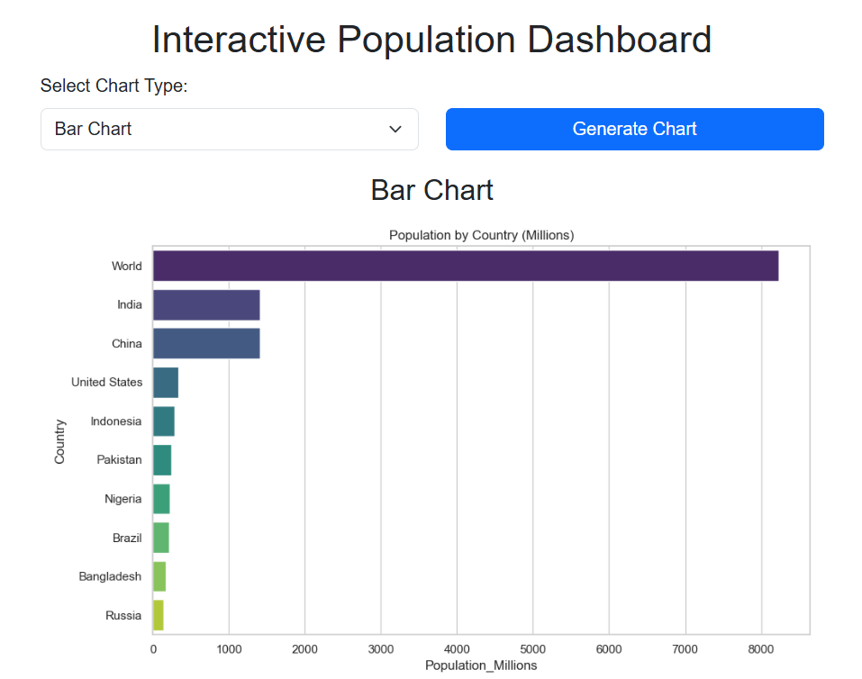

# 🌍 Interactive Population Dashboard

This project is a **Flask-based web application** that scrapes population data from Wikipedia and displays it in various **interactive charts** and **tables**. The dashboard uses **Matplotlib**, **Seaborn**, and **Pandas** for data processing and visualization.

---

## 🧰 Features

- Web scraping from Wikipedia
- Tabular data display
- Data cleaning and preprocessing
- Multiple chart types:
  - Bar chart
  - Pie chart
  - Histogram
  - Line chart
  - Bubble chart
  - Scatter plot
  - Heatmap
  - Box plot
- Responsive HTML template with Bootstrap
- Dynamic rendering of charts using Flask routing

---

## 📷 Screenshots

### 📊 Dashboard UI


### 📈 Example: Bar Chart



### 📉 Example: Pie Chart


> 💡 *Add your actual screenshots in the `images/` folder using the above file names.*

---

## 🏗️ Folder Structure

population-dashboard/
├── app.py
├── templates/
│ └── interactive_dashboard.html
├── static/
│ └── style.css (optional)
├── images/
│ ├── dashboard_ui.png
│ ├── bar_chart.png
│ └── pie_chart.png
├── README.md
├── LICENSE
└── requirements.txt


---

## 🚀 Getting Started

### 1. Clone the Repository

```bash
git clone https://github.com/yourusername/population-dashboard.git
cd population-dashboard

### 2. Install Dependencies

pip install -r requirements.txt

### 3. Run the app

python app.py


