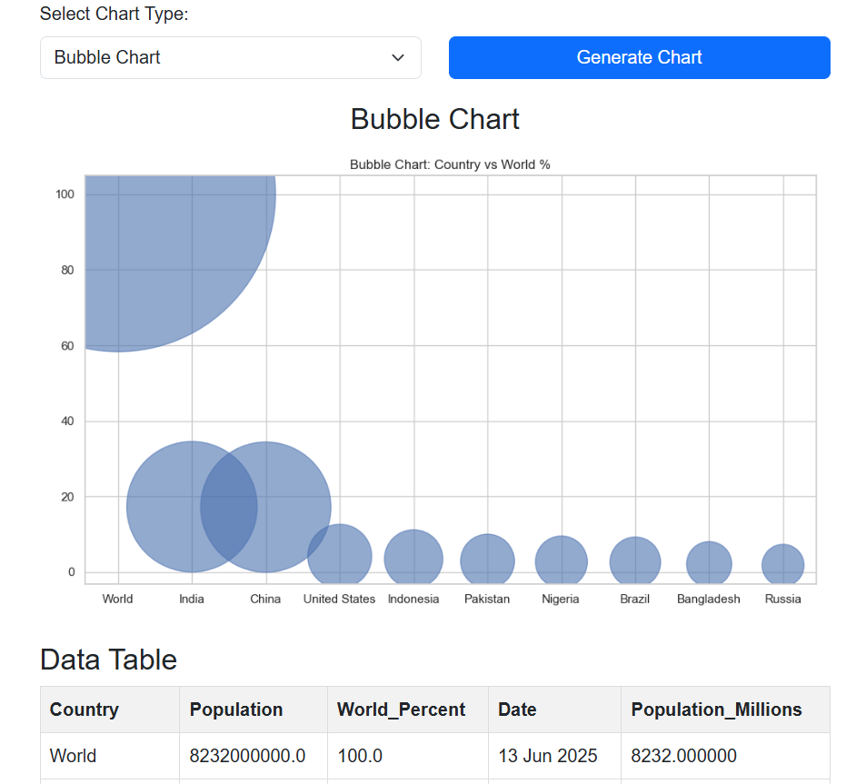
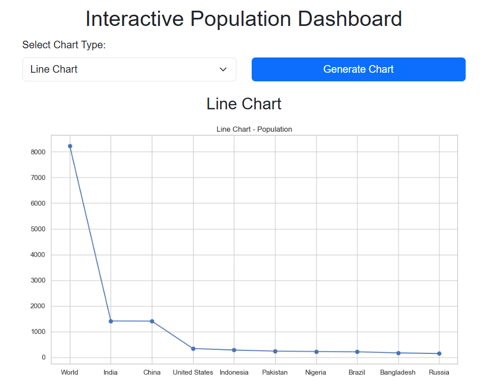

# 🌍 Interactive Population Dashboard

This project is a **Flask-based web application** that scrapes population data from Wikipedia and displays it in various **interactive charts** and **tables**. The dashboard uses **Matplotlib**, **Seaborn**, and **Pandas** for data processing and visualization.

---

## 🧰 Features

- Web scraping from Wikipedia
- Tabular data display
- Data cleaning and preprocessing
- Multiple chart types:
  - Bar chart
  - Pie chart
  - Histogram
  - Line chart
  - Bubble chart
  - Scatter plot
  - Heatmap
  - Box plot
- Responsive HTML template with Bootstrap
- Dynamic rendering of charts using Flask routing

---

## 📷 Screenshots

### 📊 Dashboard UI



### 📈 Example: Bar Chart


### 📉 Example: Line Chart




---


## 🚀 Getting Started

### Clone the Repository

```bash
git clone https://github.com/yourusername/population-dashboard.git
cd population-dashboard

### 2. Install Dependencies

pip install -r requirements.txt

### 3. Run the app

python app.py


